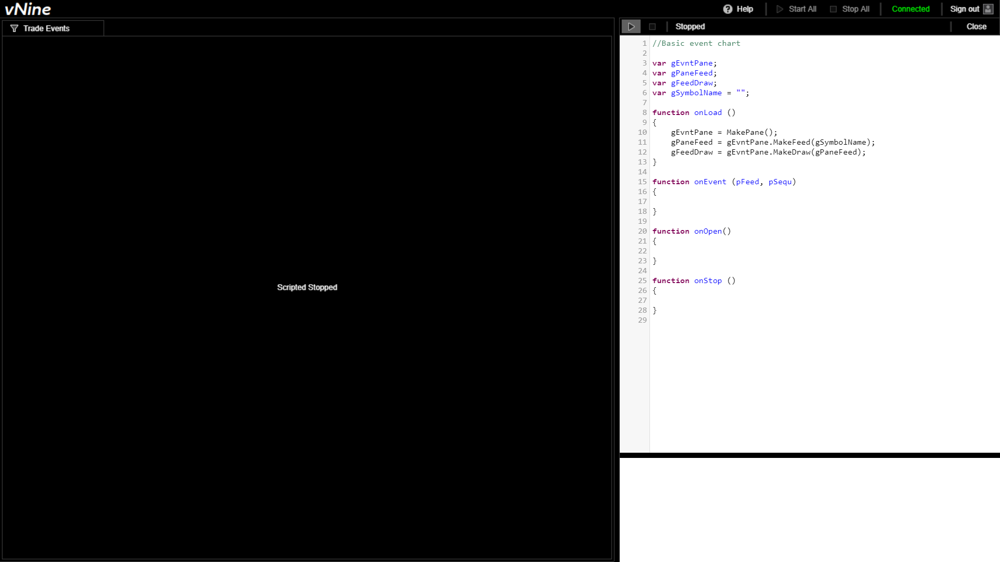

# Manual

## General Formatting

### Notation

Constants used for distinguishing variable roles

- `k` | K denotes a constant variable
- `g` | G denotes a global variable

```js
var gEvntPane;
var gPaneFeed;
var kSymbolName = "ESM9";
```

## Enumerated Constants

### CEvntFeed.FeedStep

Constants used for CEvntFeed.FeedStep

- `kStepShow` | Shows the event aggregating by time
- `kStepHide` | Withholds the even from the Symbol viewport
- `kStepHalt` | Shows the previous event
- `kStepNext` | Advances the step position

```js
gPaneFeed.FeedStep = kStepHide; //This will hide the current event in the feed
```

### kEvent.Type

Enumerated types of events

- `kEvent.Type.Trade`
- `kEvent.Type.Bid`
- `kEvent.Type.Ask`
- `kEvent.Type.ImpliedBid`
- `kEvent.Type.ImpliedAsk`
- `kEvent.Type.BookReset`

```js
if (tTick.Type == kEvent.Type.Trade)
{
	//Do something based on event being a trade
}
```

### kEvent.Trade.Aggressor

Enumerated values for getting the type of aggressor of a trade event

- `kEvent.Trade.Aggressor.Buy`
- `kEvent.Trade.Aggressor.Sell`

```js
if (tTick.Type == kEvent.Type.Trade)
{
	if (tTick.Trade.Aggressor == kEvent.Trade.Aggressor.Buy)
	{
		//Do something based on trade's aggressor being a buyer
	}
}
```

### kEvent.Bid.Type

Enumerated values for getting the type of a bid event

- `kEvent.Bid.Type.New`
- `kEvent.Bid.Type.Change`
- `kEvent.Bid.Type.Delete`
- `kEvent.Bid.Type.DeleteThru`
- `kEvent.Bid.Type.DeleteFrom`
- `kEvent.Bid.Type.Overlay`
- `kEvent.Bid.Type.Replace`

```js
if (tTick.Bid.Type == kEvent.Bid.Type.New)
{
	//Do something based on bid's type being new
}
```

### kEvent.Ask.Type

Enumerated values for getting the type of an ask event

- `kEvent.Ask.Type.New`
- `kEvent.Ask.Type.Change`
- `kEvent.Ask.Type.Delete`
- `kEvent.Ask.Type.DeleteThru`
- `kEvent.Ask.Type.DeleteFrom`

```js
if (tTick.Ask.Type == kEvent.Ask.Type.New)
{
	//Do something based on ask's type being new
}
```

### CEvntPane.Wave

Enumerated values for playing different audio files

- `Bang` | 0
- `Clang` | 1
- `Punch` | 2
- `Ring_1` | 3
- `Ring_2` | 4
- `Ring_3` | 5
- `Ring_4` | 6
- `Ring_5` | 7
- `Ring_6` | 8
- `Ring_7` | 9
- `Slap` | 10

```js
CEvntPane.PlayWave(0); //Plays a bang!
```

## Built-in Functions

### onLoad()

The built in onLoad function is called when the user clicks the run button shown below.

```js
function onLoad ()
{
    gEvntPane = MakePane();
    gPaneFeed = gEvntPane.MakeFeed(gSymbolName);
    gDrawFeed = gEvntPane.MakeDraw(gPaneFeed);	
}
```

- ```MakePane()``` | Returns a new [CEVNTPane](https://bblake.info/doc/class/src/index.js~CEvntPane.html) object
- ```gEvntPane.MakeFeed(gSymbolName)``` | Returns a new [CEVNTFeed](https://bblake.info/doc/class/src/index.js~CEvntFeed.html) object based on the specified symbol name 
- ```gEvntPane.MakeDraw(gPaneFeed)``` | Returns a new [CEVNTDraw](https://bblake.info/doc/class/src/index.js~CEVNTDraw.html) object



### onOpen()

The built in onOpen function is called once the pane has properly loaded and rendered the Symbol information.

```js
function onOpen ()
{
	
}
```

### onEvent()

The built in onEvent function is called once for each timestamp you play back.

```js
function onEvent (pFeed, pSequ)
{
	
}
```

- ```pFeed``` | Parameter: Your [CEVNTFeed](https://bblake.info/doc/class/src/index.js~CEvntPane.html) object with timestamps measured in nanoseconds with 56 bit precision
- ```pSequ``` | Parameter: An integer that defaults to 0 that is used for Amount of events within this sequence

### onStop()

The built in onStop function is called when the user clicks the stop button shown below.

```js
function onStop ()
{
	
}
```

