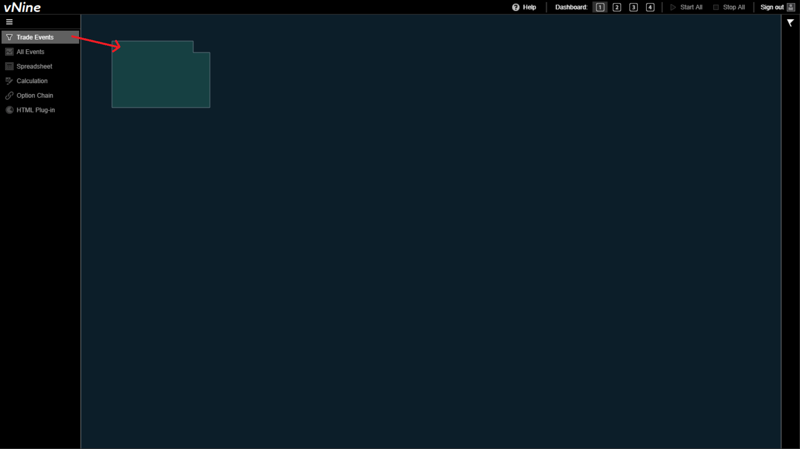
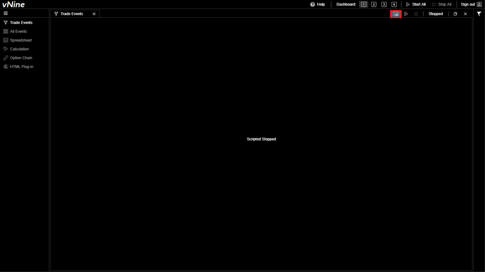

# Tutorial: The Basics

## Step 1: Pane creation

Drag a new pane into your vNine dashboard



## Step 2: Opening the editor

Click the JS button to open up the Javascript-esc editor. 
You should be presented with an empty sample script corresponding to your new pane



## Step 3: Declaring your variables

Once you've opened your Javascript editor, you should see your main CEVNTPane and CEVNTFeed variables. 
These are most commonly defined as gEvntPane and gPaneFeed.  

```js
var gEvntPane;
var gPaneFeed;
var kSymbolName = "ESM9";
```

- [CEVNTPane](https://bblake.info/doc/class/src/index.js~CEvntPane.html) ```gEvntPane``` | 
Your pane variable allows you to create just about everything else we're going to need 
to make use of your script.
- [CEVNTFeed](https://bblake.info/doc/class/src/index.js~CEvntFeed.html) ```gPaneFeed``` | 
Your feed variable will be used to track and make use of every single [Event](https://bblake.info/doc/class/src/index.js~Event.html) 
that has occured since the exchange last opened.
- [string](//TODO link to string type) ```kSymbolName``` | 
The symbol name is the technical name of the symbol we want to interpret. 
A list of symbol names can be found at ____.

[//]: # "[symbols](link to symbol names)"

## Step 4: Understanding onLoad

The built in onLoad function is called when the user clicks the run button shown below.

```js
function onLoad ()
{
    gEvntPane = MakePane();
    gPaneFeed = gEvntPane.MakeFeed(gSymbolName);
    gDrawFeed = gEvntPane.MakeDraw(gPaneFeed);	
}
```

- ```MakePane()``` | Returns a new [CEVNTPane](https://bblake.info/doc/class/src/index.js~CEvntPane.html) object
- ```gEvntPane.MakeFeed(gSymbolName)``` | Returns a new [CEVNTFeed](https://bblake.info/doc/class/src/index.js~CEvntFeed.html) object based on the specified symbol name 
- ```gEvntPane.MakeDraw(gPaneFeed)``` | Returns a new [CEVNTDraw](https://bblake.info/doc/class/src/index.js~CEVNTDraw.html) object


## Step 5: Understanding onOpen

The built in onOpen function is called once the pane has properly loaded and rendered the Symbol information. 
For now, we won't make use of this function, but it is important to know what it does for the future.

```js
function onOpen ()
{
	
}
```

## Step 6: Understanding onEvent

The built in onEvent function is called once for each timestamp you play back. 
For now, we won't make use of this function, but it is important to know what it does for the future.

```js
function onEvent (pFeed, pSequ)
{
	
}
```

- ```pFeed``` | Parameter: Your [CEVNTFeed](https://bblake.info/doc/class/src/index.js~CEvntPane.html) object with timestamps measured in nanoseconds with 56 bit precision
- ```pSequ``` | Parameter: An integer that defaults to 0 that is used for Amount of events within this sequence

## Step 7: Understanding onStop

The built in onStop function is called when the user clicks the stop button shown below. 
For now, we won't make use of this function, but it is important to know what it does for the future.

[//]: # "//TODO add image"

```js
function onStop ()
{
	
}
```


## Results

#### Congratulations

At this point, you should see a chart based off of your selected Symbol for the most recent exchange period like the one shown below! 
Feel free to zoom in and out and scroll through your newly created chart.


[//]: # "//TODO add image"

#### Troubleshooting

For certain periods throughout the day, EVNTScript will not be able to generate charts. 
This is because the vNine platform makes use of the time in which the exchange is down to process and archive data. 
Below is a chart containing weekly hours of downtime.

| Monday        | Tuesday       | Wednesday     | Thursday      | Friday  | Saturday | Sunday  |
|---------------|---------------|---------------|---------------|---------|----------|---------|
| 4:00pm-5:00pm | 4:00pm-5:00pm | 4:00pm-5:00pm | 4:00pm-5:00pm | 4:00pm- | -        | -5:00pm |

Also, please note that some contracts also stop the exchange from 3:15pm-3:30pm on weekdays.

#### Contact

If you come across any major issue/bugs, please let us know by sending an email with an explanation of what occured to 
[support@vertex-analytics.com](mailto:support@vertex-analytics.com).

Additionally, if there is something that you think we could improve about this documentation, 
please create a new issue at our repository's [issues page](https://github.com/PlGGS/xva-doc/issues).
